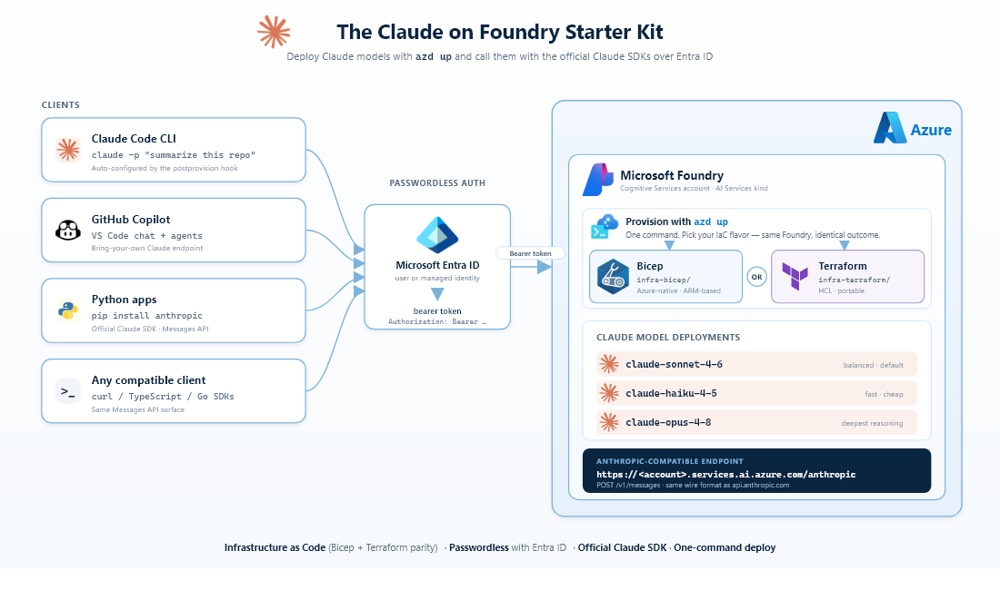

<!--
---
page_type: sample
languages:
- python
- typescript
- go
- csharp
- java
products:
- azure-openai
- azure
urlFragment: claude
name: The Claude on Foundry Starter Kit
description: Deploy Claude models in Microsoft Foundry using one CLI command with Bicep or Terraform. Includes Anthropic SDK for Python examples using the Messages API. Wires up Claude Code so you can run the agentic CLI against your fresh deployment immediately.
---
-->

# The Claude on Foundry Starter Kit

> Short link: **<https://aka.ms/claude/start>**

**The fastest way to get started with Claude on Microsoft Foundry.**

Rapidly deploy a [Microsoft Foundry](https://learn.microsoft.com/azure/ai-foundry/) account with one or more **Claude** model deployments (haiku, sonnet, opus) using a single CLI command, then call it with the **[Claude SDK](https://docs.claude.com/en/api/client-sdks)** using Microsoft Entra ID — end-to-end via [Azure Developer CLI (`azd`)](https://learn.microsoft.com/azure/developer/azure-developer-cli/). `azd up` also wires up **[Claude Code](https://learn.microsoft.com/azure/foundry/foundry-models/how-to/configure-claude-code)** so you can run the agentic CLI against your fresh deployment immediately. Ships in both Bicep and Terraform.

## Architecture Overview



A single `azd up` stands up your chosen Claude models (haiku, sonnet, opus) behind one Microsoft Foundry endpoint, then wires the Anthropic SDK and the Claude Code CLI to it over Entra ID — no API keys stored.

## Pick a variant

Two equivalent IaC variants ship side-by-side. Pick one and `azd up`:

| Variant | Folder | Run from |
|---|---|---|
| **Bicep** | [`infra-bicep/`](./infra-bicep/) | `cd infra-bicep && azd up` |
| **Terraform** | [`infra-terraform/`](./infra-terraform/) | `cd infra-terraform && azd up` |

The Python sample under [`src/`](./src/) works against either.

> [!IMPORTANT]
> **By running `azd up` you accept Anthropic's commercial terms for Claude.**
>
> The Terraform and Bicep in this template both send a `modelProviderData` block (`organizationName`, `countryCode`, `industry`) with each Claude deployment. The Cognitive Services RP uses that block to **auto-sign the Azure Marketplace offer for Anthropic Claude on your behalf** — no manual click-through. Before deploying, please:
>
> 1. Read the legal docs that govern your use of Claude via Microsoft Foundry:
>    - [Anthropic Commercial Terms of Service](https://www.anthropic.com/legal/commercial-terms) — the master agreement for business / enterprise use (Foundry requires an Enterprise or MCA-E subscription).
>    - [Anthropic Usage Policy](https://www.anthropic.com/legal/aup) (also called the Acceptable Use Policy / AUP) — incorporated by reference into the Commercial Terms and the doc Microsoft Foundry's own [Responsible AI guidance](https://learn.microsoft.com/azure/ai-foundry/foundry-models/how-to/use-foundry-models-claude#responsible-ai-considerations) points to.
>    - [Anthropic Supported Regions Policy](https://aka.ms/supported_anthropic_regions) — also incorporated by reference; controls which regions are eligible.
>    - [Microsoft Product Terms](https://www.microsoft.com/licensing/terms/) for Azure.
> 2. **Update the three attestation fields below so they accurately describe your organization** — see the highlighted rows in [Configuration](#configuration):
>    - `CLAUDE_ORGANIZATION_NAME` (no default — required)
>    - `CLAUDE_COUNTRY_CODE` (default `US`)
>    - `CLAUDE_INDUSTRY` (default `technology`)
>
>    These values are sent to Anthropic on every request and are part of your acceptance — they should match the real legal entity, country of operation, and industry that will use the model.
> 3. Confirm your Azure subscription is [eligible to deploy Anthropic models in Foundry](https://learn.microsoft.com/azure/ai-foundry/foundry-models/how-to/use-foundry-models-claude#prerequisites).
>
> <details>
> <summary>Preview the dialog Foundry would show on the manual path, and audit acceptance after <code>azd up</code></summary>
>
> The exact "Agree and proceed" dialog the Azure portal renders for a Claude SKU is generated live from the Marketplace offer metadata (Microsoft template + publisher-supplied links). It can change without notice, so this README does not snapshot its text — instead, open the live marketplace listing for the SKU you plan to deploy:
>
> - Sonnet 4.6 — <https://azuremarketplace.microsoft.com/en-us/marketplace/apps/anthropic.anthropic-claude-sonnet-4-6-offer>
> - Opus 4.6 — <https://azuremarketplace.microsoft.com/en-us/marketplace/apps/anthropic.anthropic-claude-opus-4-6-offer>
> - Haiku 4.5 — <https://azuremarketplace.microsoft.com/en-us/marketplace/apps/anthropic.anthropic-claude-haiku-4-5-offer>
> - All Anthropic offers — <https://azuremarketplace.microsoft.com/en-us/marketplace/apps?search=anthropic>
>
> After `azd up`, you can audit the auto-signed marketplace agreement record from the CLI (returns metadata only — `accepted`, `signature`, signed-by, date, `licenseTextLink` — not the dialog text):
>
> ```bash
> az term show \
>   --publisher anthropic \
>   --product anthropic-claude-sonnet-4-6-offer \
>   --plan <plan-name>
> ```
>
> </details>

> **Looking for something more advanced?** Jump to: [Claude Code post-deploy setup](#claude-code-post-deploy-setup) · [auto-refreshing Entra ID tokens for long-running processes](#advanced-long-running-processes-auto-refreshing-the-entra-id-token) · [preprovision preflight](#preprovision-preflight-marketplace-catalog--quota) · [check Claude quota & capacity programmatically](#advanced-check-claude-quota--capacity-programmatically).

## Need help? Ask your AI agent

This repo ships an AI agent skill in the open [Agent Skills](https://agentskills.io/) format, so any assistant that reads [`AGENTS.md`](./AGENTS.md) or [`.github/copilot-instructions.md`](./.github/copilot-instructions.md) &mdash; GitHub Copilot Chat, Claude Code, OpenAI Codex, Cursor, Gemini CLI, Amp, Goose, Junie, Qodo, and friends &mdash; onboards you in plain English. No need to scroll the troubleshooting table or memorize env vars.

**How to use it:** clone the repo, open it in your preferred agent, and ask in natural language. Try:

- *"Deploy Claude haiku to `eastus2` with 50 TPM."*
- *"Why is `azd up` failing with `715-123420`?"*
- *"Free up quota held by soft-deleted accounts in `swedencentral`."*
- *"Verify Claude Code is wired up to my Foundry deployment."*
- *"Tear it all down cleanly."*

Already cloned and in a workspace? Your agent picks the skill up automatically. To add it to a different workspace, run:

```bash
npx skills add Azure-Samples/claude
```

The assistant follows the playbook in [`skills/claude-on-foundry/SKILL.md`](./skills/claude-on-foundry/SKILL.md) and the always-on rules in [`AGENTS.md`](./AGENTS.md) / [`.github/copilot-instructions.md`](./.github/copilot-instructions.md) &mdash; using this repo's scripts, env-var contract, region matrix, and error catalog instead of guessing. It also confirms with you before any destructive action (`azd down`, `az cognitiveservices account purge`, RBAC removal).

## Prerequisites

- An Azure subscription [eligible to deploy Claude in Foundry](https://learn.microsoft.com/azure/ai-foundry/foundry-models/how-to/use-foundry-models-claude#prerequisites), with `Contributor` on the target subscription/resource group (see [Required permissions](#required-permissions) for the full breakdown, including the data-plane role you need to call the model).
- Region: `eastus2` or `swedencentral` host all three Claude families (haiku / sonnet / opus). `westus2` is sonnet + opus only.
- Tools: [Azure CLI](https://learn.microsoft.com/cli/azure/install-azure-cli), [azd](https://learn.microsoft.com/azure/developer/azure-developer-cli/install-azd), Python ≥ 3.10, and [Terraform](https://developer.hashicorp.com/terraform/install) ≥ 1.6 (Terraform variant only).
- Run `az login` once (in addition to `azd auth login` below). The `preprovision` hook uses `az` to validate that each requested Claude SKU exists in the Anthropic-on-Foundry catalog and that you have enough TPM quota in the chosen region. If `az` isn't installed or signed in, the hook warns and skips those checks so `azd up` still works &mdash; you just lose the proactive error messages.

## Quickstart

```powershell
git clone https://github.com/Azure-Samples/claude.git
cd claude/infra-terraform   # or: cd claude/infra-bicep

# If your Claude-eligible subscription lives in a non-default tenant, pass --tenant-id:
azd auth login   # or: azd auth login --tenant-id <tenant-id>

azd env new my-claude   # answer 'y' when asked "Set new environment ... as default?"
                        # (if you already created the env, run `azd env select my-claude`)
azd env set CLAUDE_ORGANIZATION_NAME "Contoso"
azd env set AZURE_LOCATION "swedencentral"

# Anthropic model-provider attestation (sent to Anthropic with every request,
# part of accepting their commercial terms — see the IMPORTANT note above).
# Defaults are US / technology. Override if your org is not US-based or not tech:
# azd env set CLAUDE_COUNTRY_CODE "GB"
# azd env set CLAUDE_INDUSTRY     "finance"

# Pick which Claude families to deploy. Empty = skip that family.
# Defaults below = all three; comment out any line to deploy a subset.
azd env set CLAUDE_HAIKU_MODEL  "claude-haiku-4-5"
azd env set CLAUDE_SONNET_MODEL "claude-sonnet-4-6"
azd env set CLAUDE_OPUS_MODEL   "claude-opus-4-6"

# Optional — skip the interactive subscription picker on first `azd up`:
# azd env set AZURE_SUBSCRIPTION_ID <subscription-id>
# Optional — also install the Claude Code CLI as part of postprovision:
# azd env set CLAUDE_CODE_AUTO_INSTALL true
azd up
```

> **Want just one family?** Set only that one (e.g. just `CLAUDE_OPUS_MODEL`) and leave the others unset. Want to override capacity per family? Set `CLAUDE_HAIKU_CAPACITY` / `CLAUDE_SONNET_CAPACITY` / `CLAUDE_OPUS_CAPACITY` (TPM ÷ 1000, default 25 each). See [Choosing which models to deploy](#choosing-which-models-to-deploy).

`azd up` provisions Foundry + the Claude deployment, then a **postprovision** hook ([`scripts/configure-claude-code.ps1`](./scripts/configure-claude-code.ps1)) writes a `claude-code.env.ps1` / `claude-code.env.sh` activator at the repo root and pins a workspace default via `.claude/settings.json`. See [Claude Code post-deploy setup](#claude-code-post-deploy-setup) for details.

### Use Claude Code

```powershell
# from the repo root
. ./claude-code.env.ps1     # PowerShell. macOS/Linux: source ./claude-code.env.sh
claude
```

If `claude` isn't installed yet, the postprovision hook prints the one-line installer command for your platform (or set `CLAUDE_CODE_AUTO_INSTALL=true` before `azd up` to run it automatically). To verify the wiring see [Verify Claude Code is wired up](#verify-claude-code-is-wired-up).

### Or use the Python sample

```powershell
# from infra-bicep/ or infra-terraform/ (so `azd env get-values` works)
# Use Out-File so the file is UTF-8 (Windows PowerShell 5.1's `>` writes UTF-16, which python-dotenv mis-parses).
azd env get-values | Out-File -Encoding utf8 ..\.env.local
# macOS/Linux: azd env get-values > ../.env.local

cd ..
python -m venv .venv && . .venv/Scripts/Activate.ps1   # macOS/Linux: source .venv/bin/activate
pip install -r requirements.txt
python src/hello_claude.py                  # one-shot Messages call (Entra ID)
python src/chat_stream.py                   # interactive streaming chat — type a message, `exit` to quit
python src/hello_claude_token_refresh.py    # long-running variant with per-request token refresh
```

<details>
<summary><strong>Alternative: API-key auth (dev/test only)</strong></summary>

If you don't have a data-plane role on the Foundry account yet, you can run a quick check with an API key. Prefer Entra ID for anything beyond local testing — keys can't be scoped per-user and rotate manually.

```powershell
# FOUNDRY_ACCOUNT_NAME and AZURE_RESOURCE_GROUP are emitted by `azd env get-values`
$env:CLAUDE_API_KEY = (az cognitiveservices account keys list `
    --name $env:FOUNDRY_ACCOUNT_NAME `
    --resource-group $env:AZURE_RESOURCE_GROUP --query key1 -o tsv)
python src/hello_claude_apikey.py
```

</details>

## Configuration

Rows marked **Attest** below are the three `modelProviderData` fields sent to Anthropic and used by the marketplace RP to auto-sign the [Anthropic Commercial Terms](https://www.anthropic.com/legal/commercial-terms) (which incorporate the [Usage Policy](https://www.anthropic.com/legal/aup) and [Supported Regions Policy](https://aka.ms/supported_anthropic_regions) by reference) on your behalf — see the [IMPORTANT note at the top of this README](#claude-on-microsoft-foundry--starter). Set them to match your real organization.

| Var | Required | Default | Notes |
|---|---|---|---|
| `CLAUDE_ORGANIZATION_NAME` | **Attest** (yes) | — | **Legal entity name** sent to Anthropic via `modelProviderData`. |
| `CLAUDE_COUNTRY_CODE` | **Attest** | `US` | 2-letter ISO. Country your organization operates from. |
| `CLAUDE_INDUSTRY` | **Attest** | `technology` | **lowercase**: `technology`, `finance`, `healthcare`, `education`, `retail`, `manufacturing`, `government`, `media`, `other` |
| `AZURE_LOCATION` | yes | — | `eastus2` / `swedencentral` (all 3 families) / `westus2` (sonnet + opus) |
| `CLAUDE_HAIKU_MODEL` | no | *(empty)* | Haiku family model id (e.g. `claude-haiku-4-5`). Empty = skip. |
| `CLAUDE_SONNET_MODEL` | no | *(empty)* | Sonnet family model id (e.g. `claude-sonnet-4-6`). Empty = skip. |
| `CLAUDE_OPUS_MODEL` | no | *(empty)* | Opus family model id (e.g. `claude-opus-4-6`). Empty = skip. |
| `CLAUDE_HAIKU_CAPACITY` | no | `25` | Haiku TPM / 1000 |
| `CLAUDE_SONNET_CAPACITY` | no | `25` | Sonnet TPM / 1000 |
| `CLAUDE_OPUS_CAPACITY` | no | `25` | Opus TPM / 1000 |
| `CLAUDE_MODEL_VERSION` | no | `1` | Applies to all deployed families. |
| `CLAUDE_MODEL_NAME` | no | `claude-sonnet-4-6` | **Legacy.** Only used when all three `CLAUDE_*_MODEL` vars are empty (single-deployment fallback). |
| `CLAUDE_MODEL_CAPACITY` | no | `25` | **Legacy.** Capacity for the legacy single-deployment fallback. |
| `ASSIGN_RBAC` | no | `false` | `true` to grant `Foundry User` + `Foundry Project Manager` to `AZURE_PRINCIPAL_ID` (needs `roleAssignments/write`) |
| `CLAUDE_CODE_AUTO_INSTALL` | no | `false` | `true` to let the postprovision hook run the official Claude Code installer ([`install.ps1`](https://claude.ai/install.ps1) / [`install.sh`](https://claude.ai/install.sh)) when `claude` isn't already on PATH |

### Choosing which models to deploy

Set one, two, or all three of `CLAUDE_HAIKU_MODEL` / `CLAUDE_SONNET_MODEL` / `CLAUDE_OPUS_MODEL` — each non-empty value deploys that family into the same Foundry account. The postprovision hook writes one `ANTHROPIC_DEFAULT_<FAMILY>_MODEL` env var per deployed family into the activator + `.vscode/settings.json`, so Claude Code can route across all three.

| Goal | Set |
|---|---|
| All three families (recommended) | `CLAUDE_HAIKU_MODEL=claude-haiku-4-5`, `CLAUDE_SONNET_MODEL=claude-sonnet-4-6`, `CLAUDE_OPUS_MODEL=claude-opus-4-8` |
| Just sonnet | `CLAUDE_SONNET_MODEL=claude-sonnet-4-6` (leave the others unset) |
| Just opus | `CLAUDE_OPUS_MODEL=claude-opus-4-8` (or an earlier `-4-x` if quota is tight) |
| Single legacy model (back-compat) | `CLAUDE_MODEL_NAME=...` and leave all `CLAUDE_*_MODEL` vars empty |

Run [`./Get-ClaudeCatalog.ps1`](./Get-ClaudeCatalog.ps1) to see the live catalog and pick model versions matching your region. Examples:

```powershell
./Get-ClaudeCatalog.ps1            # compact table: model, version, regions, context, capacity, retirement date
./Get-ClaudeCatalog.ps1 -Latest    # just the newest generation per family
```

## Claude Code post-deploy setup

After `azd up` succeeds, the **postprovision** hook ([`scripts/configure-claude-code.ps1`](./scripts/configure-claude-code.ps1), with [`configure-claude-code.sh`](./scripts/configure-claude-code.sh) as a POSIX fallback) configures [Claude Code](https://learn.microsoft.com/azure/foundry/foundry-models/how-to/configure-claude-code) for the freshly-deployed Foundry resource. It does four things:

1. Writes a project-scoped activator at the repo root (`claude-code.env.ps1` and `claude-code.env.sh`, both gitignored) containing the [environment variables](https://learn.microsoft.com/azure/foundry/foundry-models/how-to/configure-claude-code?tabs=bash#configure-claude-code-for-foundry) Claude Code expects:
   - `CLAUDE_CODE_USE_FOUNDRY=1`
   - `ANTHROPIC_FOUNDRY_RESOURCE=<your-foundry-account-name>`
   - One `ANTHROPIC_DEFAULT_<FAMILY>_MODEL=<deployment-name>` per deployed family (`HAIKU` / `SONNET` / `OPUS`). Only the families you actually deployed get a line.
   - **`AZURE_CONFIG_DIR=<repo>/.azure-cli`** &mdash; scopes `az login` (and `azd`) to this workspace only. See [Workspace-scoped `az login`](#workspace-scoped-az-login) below.
2. **(Opt-in)** Writes (or merges into) `.vscode/settings.json` with `claudeCode.environmentVariables` (the array-of-`{name,value}` schema the extension actually reads &mdash; the display name in the Settings UI is *"Claude Code: Environment Variables"*) and `claudeCode.disableLoginPrompt: true` so the [Claude Code VS Code extension](https://marketplace.visualstudio.com/items?itemName=anthropic.claude-code) skips the Anthropic-account login and uses your Foundry deployment via Entra ID. It also sets `terminal.integrated.env.{windows,linux,osx}.AZURE_CONFIG_DIR` so every terminal VS Code spawns in this workspace inherits the scoped Azure config automatically &mdash; you don't even have to source the activator first. **This step only runs if you ask for it** &mdash; the hook leaves `.vscode/settings.json` alone by default since most users run Claude from the SDK, the Claude Code CLI (which only needs the activator at step 1), or another OpenAI-compatible client. **Using the Claude Code extension?** Opt in before `azd up` with `azd env set CLAUDE_WRITE_VSCODE_SETTINGS 1` (or pass `-WriteVsCodeSettings` / `--write-vscode-settings` when running the script standalone).
3. Writes (or merges into) `.claude/settings.json` at the repo root with `{ "model": "<family>" }` pinned to a deployed family (sonnet &gt; opus &gt; haiku priority). This is the **workspace-level** Claude Code config and overrides whatever is in your user-global `~/.claude/settings.json` &mdash; so bare `claude` / `claude -p` resolves to a family you actually deployed, even if your global default points elsewhere.
4. Checks whether `claude` is on PATH. If not, prints the platform-appropriate one-liner install command. Set `CLAUDE_CODE_AUTO_INSTALL=true` *before* `azd up` to run [the official installer](https://claude.ai/install.ps1) automatically.

Authentication uses Microsoft Entra ID through your existing `az login` session &mdash; no API keys to manage. If the Foundry resource lives in a non-default tenant, run `az login --tenant <tenant-id>` first so the [token tenant matches the resource tenant](https://learn.microsoft.com/azure/foundry/foundry-models/how-to/configure-claude-code?tabs=bash#troubleshooting).

<a id="workspace-scoped-az-login"></a>

> **Workspace-scoped `az login`.** Both the activators and `.vscode/settings.json` set `AZURE_CONFIG_DIR=<repo>/.azure-cli` so that any `az login` (or `azd auth login`) you do here writes its token cache and config to **`./.azure-cli/`** inside the repo &mdash; never to the global `~/.azure`. The benefits:
>
> - Other VS Code windows / shells keep their own existing `~/.azure` login (different tenant, different account &mdash; whatever) and are not affected.
> - Logging out (`az logout`) or `rm -rf .azure-cli` only nukes this workspace's credentials.
> - The directory is gitignored, so credentials never reach the repo.
>
> VS Code applies the env var automatically to any terminal it opens inside this folder. If you launch a terminal outside VS Code, source the activator first (`. ./claude-code.env.ps1` or `source ./claude-code.env.sh`) before running `az login`. Verify with `az config get core` &mdash; the `config_path` should point inside the repo.

To run Claude Code in a fresh shell at any time:

```powershell
. ./claude-code.env.ps1    # PowerShell. macOS/Linux: source ./claude-code.env.sh
claude /status             # verify "API provider: Microsoft Foundry"
```

### Verify Claude Code is wired up

Four ways to confirm the CLI is talking to your fresh Foundry deployment, easiest first.

**0. One-command end-to-end check** &mdash; runs every check in this section plus an SDK round trip in one shot:

```powershell
pwsh -File scripts/verify-claude-code.ps1                    # all checks + claude -p per deployed family
pwsh -File scripts/verify-claude-code.ps1 -SkipClaudeCall    # config checks only (no token cost)
pwsh -File scripts/verify-claude-code.ps1 -RunPythonSample   # also runs python src/hello_claude.py
```

macOS/Linux:

```bash
bash scripts/verify-claude-code.sh                       # default
bash scripts/verify-claude-code.sh --skip-claude-call    # config only
bash scripts/verify-claude-code.sh --run-python-sample   # adds the Python Entra ID round trip
```

The verify script checks the activator file, env vars, `.vscode/settings.json` shape, `az` login + tenant, `claude` on PATH (with `-AutoInstall` / `--auto-install` to install it if missing), then runs a non-interactive `claude -p` per deployed family. Exits non-zero on any hard failure so you can wire it into CI.

The rest of this section is the same checks broken out manually.

**1. One-shot prompt (non-interactive)** &mdash; fastest manual check:

```powershell
. ./claude-code.env.ps1
'who are you?' | claude -p
```

You should see a one-line reply that identifies the deployed model (e.g. *"I'm Claude Sonnet 4.6, built by Anthropic."*). macOS/Linux:

```bash
source ./claude-code.env.sh
echo 'who are you?' | claude -p
```

**2. Interactive REPL** &mdash; the normal way to use it:

```powershell
. ./claude-code.env.ps1
claude
```

Useful slash commands once inside:

| Command | What it shows |
|---|---|
| `/status` | API provider (should say **Microsoft Foundry**), deployment name |
| `/model`  | Confirms the Anthropic family wired up |
| `/help`   | Full command list |

**3. VS Code extension** &mdash; install once, picks up `.vscode/settings.json` automatically:

```powershell
code --install-extension anthropic.claude-code
```

Then open the Command Palette &rarr; **"Claude Code: Start"** (or click the Claude icon in the activity bar). No extra config is needed &mdash; the postprovision hook already populated `claudeCode.environmentVariables` and `claudeCode.disableLoginPrompt` in [.vscode/settings.json](./.vscode/settings.json).

> **Still seeing a "Sign in to Claude" prompt?** Reload the window (Command Palette &rarr; **"Developer: Reload Window"**) so the extension re-reads `.vscode/settings.json`. If you used an older version of the hook that wrote a `"Claude Code: Environment Variables"` key, just re-run `pwsh -File scripts/configure-claude-code.ps1` &mdash; it strips the stale key and writes the correct `claudeCode.environmentVariables` schema.

> **Auth error?** If you see `401` / `Token tenant doesn't match resource tenant`, refresh your Azure login against the right tenant:
> ```powershell
> az login --tenant <tenant-id>   # the tenant that owns the Foundry resource
> ```

You can also re-run the hook standalone:

```powershell
pwsh -File scripts/configure-claude-code.ps1
# or:
bash scripts/configure-claude-code.sh
```

> **Multi-family support.** Set any combination of `CLAUDE_HAIKU_MODEL` / `CLAUDE_SONNET_MODEL` / `CLAUDE_OPUS_MODEL` and the template deploys each family as a sibling deployment under the same Foundry account. The hook writes one `ANTHROPIC_DEFAULT_<FAMILY>_MODEL` per deployed family into the activator + `.vscode/settings.json` automatically. See [Choosing which models to deploy](#choosing-which-models-to-deploy).

## SDK call shape

We use the plain `anthropic.Anthropic` client. The Entra ID token is captured once at startup and is valid for ~1 hour — fine for a one-shot script or a short-lived process. For long-running processes, see the [advanced section below](#advanced-long-running-processes-auto-refreshing-the-entra-id-token).

```python
from anthropic import Anthropic
from azure.identity import DefaultAzureCredential

token = DefaultAzureCredential().get_token(
    "https://ai.azure.com/.default"
).token
client = Anthropic(
    auth_token=token,
    base_url="https://<resource>.services.ai.azure.com/anthropic",
)
msg = client.messages.create(
    model="<deployment-name>",
    max_tokens=1024,
    messages=[{"role": "user", "content": "Hi"}],
)
```

> Pass the **deployment name** (not the model id) as `model`. The SDK appends `/v1/messages` to the configured `base_url`.

<details id="advanced-long-running-processes-auto-refreshing-the-entra-id-token">
<summary><strong>Advanced: long-running processes (auto-refreshing the Entra ID token)</strong></summary>

The plain `anthropic.Anthropic` client only accepts `auth_token: str | None`, so a captured token will start failing with `401 Unauthorized` after ~1 hour.

For services, daemons, long batch jobs, or notebooks left open, use [src/hello_claude_token_refresh.py](./src/hello_claude_token_refresh.py). It defines a tiny `AnthropicIdentity(Anthropic)` subclass that overrides the `auth_token` property to call `azure.identity.get_bearer_token_provider(...)` per request, giving free per-request token refresh:

```python
from azure.identity import DefaultAzureCredential, get_bearer_token_provider
# AnthropicIdentity is defined in hello_claude_token_refresh.py
from hello_claude_token_refresh import AnthropicIdentity

token_provider = get_bearer_token_provider(
    DefaultAzureCredential(), "https://ai.azure.com/.default"
)
client = AnthropicIdentity(
    azure_ad_token_provider=token_provider,
    base_url="https://<resource>.services.ai.azure.com/anthropic",
)
```

If the Anthropic SDK ever accepts a callable for `auth_token`, this shim becomes unnecessary.

</details>

<details>
<summary><strong>What gets deployed</strong></summary>

- **Microsoft Foundry** account (`Microsoft.CognitiveServices/accounts`, kind `AIServices`, SKU `S0`, `allowProjectManagement = true`)
- **Foundry project**
- One **Claude deployment per requested family** (`GlobalStandard`, with the required `modelProviderData` block) — set `CLAUDE_HAIKU_MODEL` / `CLAUDE_SONNET_MODEL` / `CLAUDE_OPUS_MODEL` to control which families. Sonnet/Opus deployments chain on the prior to avoid Foundry's per-account 409s on concurrent create.
- *Optional* RBAC: *Foundry User* + *Foundry Project Manager* on the deploying principal (set `ASSIGN_RBAC=true`). *(These roles were previously called `Azure AI User` / `Azure AI Project Manager`; Azure renamed them &mdash; the underlying role GUIDs are unchanged.)*
  - **Heads up:** without this (or a manual post-deploy grant), the Python SDK and `claude` CLI will return `401 PermissionDenied` even though `azd up` succeeded. See [Granting data-plane roles after `azd up`](#granting-data-plane-roles-after-azd-up).

</details>

<details>
<summary><strong>Repo layout</strong></summary>

```
claude/
├── infra-bicep/        # azd template — Bicep variant
├── infra-terraform/    # azd template — Terraform variant
├── scripts/
│   ├── preflight-claude.ps1          # `azd up` preflight: catalog + quota check
│   ├── preflight-claude.sh           # POSIX equivalent
│   ├── configure-claude-code.ps1     # postprovision hook: configure Claude Code for the new Foundry resource
│   ├── configure-claude-code.sh      # POSIX equivalent
│   ├── verify-claude-code.ps1        # post-deploy smoke test: activator + env + `claude -p` round trip
│   └── verify-claude-code.sh         # POSIX equivalent
├── src/
│   ├── hello_claude.py               # One-shot Messages call (Entra ID)
│   ├── hello_claude_apikey.py        # Same, but with an API key (dev/test only)
│   ├── hello_claude_token_refresh.py # Long-running variant with auto-refreshing Entra token
│   ├── chat_stream.py                # Streaming multi-turn chat loop
│   └── check_claude_quota.py         # Inspect Claude quota + capacity via ARM (see Advanced)
├── Get-ClaudeCatalog.ps1
├── requirements.txt
└── .env.sample
```

</details>

## Troubleshooting

| Symptom | Fix |
|---|---|
| `AnthropicOrganizationCreationException` / `AnthropicOrganizationCreationFailed` | `modelProviderData` is missing or malformed. Ensure all three of `organizationName`, `countryCode`, `industry` are set, and that `industry` is lowercase. |
| `Project can only be created under AIServices Kind account with allowProjectManagement set to true` | Account property missing. Both variants here set it; check you didn't downgrade the API version. |
| `404 Not Found` on inference | Base URL must end in `/anthropic` — `https://<resource>.services.ai.azure.com/anthropic`. |
| `401 Unauthorized` | Token scope must be `https://ai.azure.com/.default`. Re-run `az login`. |
| `401 Unauthorized` after ~1 hour of running | The Entra ID token captured at startup has expired. The plain `Anthropic` client doesn't auto-refresh — see the [advanced section](#advanced-long-running-processes-auto-refreshing-the-entra-id-token) for [src/hello_claude_token_refresh.py](./src/hello_claude_token_refresh.py), which uses an `AnthropicIdentity` shim to refresh per request. |
| `403 Forbidden` | Missing a data-plane role on the Foundry account. Grant `Cognitive Services User`, `Foundry User` (formerly `Azure AI User`), or `Azure AI Developer` (see permissions details below). |
| `Region not available` | Deploy to `eastus2` or `swedencentral` (or `westus2` for opus-only). |
| Subscription can't deploy Claude | Confirm subscription eligibility per the [official docs](https://learn.microsoft.com/azure/ai-foundry/foundry-models/how-to/use-foundry-models-claude#prerequisites). The [preprovision preflight](#preprovision-preflight-marketplace-catalog--quota) warns about this before `azd up` calls the RP. |
| `Error occurred when subscribing to Marketplace: Marketplace Subscription purchase eligibility check failed` | Your subscription cannot purchase the Anthropic offer (no entitlement, sandbox sub, paid-offer policy denial, etc.). Either use a subscription with Claude-on-Foundry entitlement, or pre-accept the agreement explicitly with `az term accept --publisher anthropic --product anthropic-<model>-offer --plan anthropic-<model>-plan-new`. |
| Opaque `400 715-123420 "An error occurred. Please reach out to support for additional assistance."` on the Terraform deployment step (RG / Foundry account / project all succeed) | **Insufficient quota.** Terraform's `azapi_resource` bypasses ARM preflight validation and the Cognitive Services RP returns this generic code instead of `InsufficientQuota`. **Fix:** check `az cognitiveservices usage list -l <region> --query "[?contains(name.value,'<model>')]"` — if `currentValue + requestedCapacity > limit`, lower `CLAUDE_SONNET_CAPACITY` / `CLAUDE_HAIKU_CAPACITY` / `CLAUDE_OPUS_CAPACITY` via `azd env set`, delete unused deployments to free capacity, or request a quota increase in the Foundry portal. **Also check for soft-deleted accounts** still holding quota — see [Free quota held by soft-deleted accounts](#free-quota-held-by-soft-deleted-accounts). To confirm it really is quota, re-run on the Bicep variant which surfaces the clearer `InsufficientQuota` error. |
| Bicep: `InsufficientQuota: This operation require N new capacity in quota Tokens Per Minute (thousands) - Claude <model>, which is bigger than the current available capacity X. The current quota usage is U and the quota limit is L.` | Same root cause as `715-123420` above, just with a clear message because Bicep goes through ARM preflight. Lower the capacity env var(s) or free up quota. |
| Preflight: `Marketplace offer ... not found` | `CLAUDE_MODEL_NAME` is misspelled, the model isn't in the Anthropic-on-Foundry catalog yet, or Anthropic changed the plan-name convention. |
| Preflight: `Quota insufficient` (exit 6) | Requested `CLAUDE_*_CAPACITY` plus existing usage exceeds the per-region quota limit. Lower the requested capacity, free up quota by deleting unused deployments, or [purge soft-deleted accounts](#free-quota-held-by-soft-deleted-accounts) that may still be holding TPM. |
| Quota looks full but you have no live deployments (`az cognitiveservices usage list` shows `currentValue > 0`, deployment still fails with `715-123420` / `InsufficientQuota`) | **Soft-deleted Cognitive Services accounts still reserve quota for 48 h.** A previous `azd down` (or any RG / account delete) puts the AIServices account in a recoverable state that keeps holding TPM. **Fix:** list and purge them: `az cognitiveservices account list-deleted -o table` then `az cognitiveservices account purge --name <name> --location <region> --resource-group <rg>` for each. See [Free quota held by soft-deleted accounts](#free-quota-held-by-soft-deleted-accounts). |
| `401 PermissionDenied: Principal does not have access to API/Operation` intermittently &mdash; same code passes seconds later | Data-plane RBAC propagation lag on a freshly-granted role (`Cognitive Services User` / `Foundry User` / `Azure AI Developer`). The grant can take a few minutes to land on the Foundry data plane even after `az role assignment create` returns. Wait a minute and retry; if it still fails consistently, verify the role with `az role assignment list --assignee <oid> --scope <foundry-account-id> -o table`. |
| `claude -p` returns `The model claude-<family>-... is not available on your foundry deployment. Try --model to switch to ...` | Your user-global `~/.claude/settings.json` has `"model"` set to a family this workspace didn't deploy. The postprovision hook writes a workspace `.claude/settings.json` with `"model"` pinned to a deployed family, which overrides the global &mdash; but if you re-ran `azd up` *before* the hook update, or your global has a per-project override, the workspace pin won't apply. Either re-run `pwsh -File scripts/configure-claude-code.ps1` to regenerate `.claude/settings.json`, pick the family explicitly via `claude -p --model <sonnet\|opus\|haiku>`, or edit `~/.claude/settings.json` to remove the `"model"` line. |
| Windows: `UnicodeEncodeError: 'charmap' codec can't encode character '\U0001f60a'` printing the model's response | The Foundry sample apps happily return emoji and other non-CP1252 characters; the default Windows console (cp1252) can't render them. Either set `$env:PYTHONIOENCODING = "utf-8"` before running, or switch the console to UTF-8 with `chcp 65001`. The Python samples already handle this gracefully, but third-party tooling may not. |
| `check_claude_quota.py` exits with `Could not resolve a subscription id ... [WinError 2] The system cannot find the file specified` | The script falls back to `az account show` to find a subscription, but the Azure CLI isn't on `PATH` in the active shell. Either set `$env:AZURE_SUBSCRIPTION_ID = "<sub-id>"` or pass `--subscription <sub-id>` explicitly. |

<details>
<summary><strong>Why <code>modelProviderData</code> matters</strong></summary>

Claude deployments fail with `AnthropicOrganizationCreationException` if `modelProviderData` is missing. **`industry` must be lowercase** to match the Foundry portal dropdown.

The Terraform variant uses `azapi_resource` for both the Foundry account and the Claude deployment, because the native `azurerm_cognitive_account` / `azurerm_cognitive_deployment` resources do not yet expose `allowProjectManagement` or `modelProviderData` ([tracked here](https://github.com/hashicorp/terraform-provider-azurerm/issues/31140)). The Bicep variant uses native resources at API version `2025-10-01-preview`, which support both.

</details>

<details id="preprovision-preflight-marketplace-catalog--quota">
<summary><strong>Preprovision preflight: Marketplace catalog &amp; quota</strong></summary>

Both IaC variants run [`scripts/preflight-claude.ps1`](./scripts/preflight-claude.ps1) (with [`preflight-claude.sh`](./scripts/preflight-claude.sh) as a POSIX fallback) from the `preprovision` hook in `azure.yaml`, to give you a fast, descriptive error for the most common misconfigurations before `azd up` calls the Cognitive Services RP.

What the preflight does, and does not, do:

| Check | Behavior |
|---|---|
| `CLAUDE_ORGANIZATION_NAME` / `AZURE_LOCATION` set | Hard fail (exit 1) if missing. |
| Marketplace offer/plan resolves | Hard fail (exit 4) on 400 "offer not found" — catches `CLAUDE_MODEL_NAME` typos and unreleased SKUs. The script queries publisher `anthropic` with offer/plan naming `anthropic-<model-name>-offer` / `anthropic-<model-name>-plan-new`. |
| Marketplace agreement `properties.accepted == true` | Warns only. The Cognitive Services RP auto-signs the agreement during deployment on eligible subs, so an unsigned status is informational. Pre-accept manually if your sub blocks RP-initiated subscribes. |
| `az cognitiveservices usage list` quota headroom for the SKU | **Hard fail (exit 6)** if `currentValue + requested > limit`. This is the most common cause of deployment failures and the preflight blocks `azd up` early with an actionable message. |

> **Why a quota check?** The Cognitive Services RP returns an opaque `400 715-123420 "An error occurred. Please reach out to support for additional assistance."` when there isn't enough TPM quota for the requested capacity. Worse, Terraform's `azapi_resource` skips ARM preflight validation, so the user sees this opaque code with no hint that quota is the cause. (Bicep / `az deployment group create` surface the real `InsufficientQuota` error.) The preflight catches the same condition before the deployment is even attempted, with a clear message and remediation instructions.

Run it standalone any time:

```powershell
$env:CLAUDE_ORGANIZATION_NAME = "Contoso"
$env:AZURE_LOCATION = "eastus2"
$env:CLAUDE_MODEL_NAME = "claude-sonnet-4-6"
$env:CLAUDE_SONNET_CAPACITY = "25"   # default 25; lower further if quota is tight
pwsh -File scripts/preflight-claude.ps1
```

If the quota check fails, see what's used:

```powershell
az cognitiveservices usage list -l eastus2 --query "[?contains(name.value,'claude-sonnet-4-6')].{quota:name.value, used:currentValue, limit:limit}" -o table
```

To list all Anthropic agreements (signed or not) visible on the active subscription:

```powershell
$sub = az account show --query id -o tsv
az rest --method get --url "https://management.azure.com/subscriptions/$sub/providers/Microsoft.MarketplaceOrdering/agreements?api-version=2021-01-01" --query "value[?properties.publisher=='anthropic']"
```

To pre-accept explicitly (rarely needed thanks to the RP auto-accept; useful for restricted-subscription scenarios):

```powershell
az term accept --publisher anthropic --product anthropic-claude-sonnet-4-6-offer --plan anthropic-claude-sonnet-4-6-plan-new
```

</details>

<details id="free-quota-held-by-soft-deleted-accounts">
<summary><strong>Free quota held by soft-deleted Cognitive Services accounts</strong></summary>

When you `azd down` (or otherwise delete) a Foundry / AIServices account, Azure does **not** immediately release the TPM quota it reserved. The account moves to a *soft-deleted* state and **continues to count against your per-model quota** for up to 48 hours, after which it is permanently purged automatically.

In day-to-day testing — where you may create and destroy several Foundry accounts in the same region in quick succession — this is the most common cause of "quota looks full but I have no live deployments" failures (which surface as opaque `715-123420` from Terraform or `InsufficientQuota` from Bicep).

**List soft-deleted accounts in the active subscription:**

```powershell
az cognitiveservices account list-deleted --query "[].{name:name, location:location, deletionDate:properties.deletionDate}" -o table
```

**Purge them one at a time** (the original RG name is part of the deleted-account id and must be passed verbatim — the RG itself does not have to still exist):

```powershell
az cognitiveservices account purge `
  --name <account-name> `
  --location <region> `
  --resource-group <original-rg-name>
```

**Purge all of them in parallel** (faster — each purge is a slow LRO):

```powershell
$accounts = az cognitiveservices account list-deleted -o json | ConvertFrom-Json
$jobs = foreach ($a in $accounts) {
    $rg = ($a.id -split '/')[8]   # /subscriptions/<sub>/providers/Microsoft.CognitiveServices/locations/<loc>/resourceGroups/<rg>/deletedAccounts/<name>
    Start-Job -ScriptBlock {
        param($n,$l,$r)
        az cognitiveservices account purge --name $n --location $l --resource-group $r
    } -ArgumentList $a.name, $a.location, $rg
}
$jobs | Wait-Job | Receive-Job
$jobs | Remove-Job
```

POSIX equivalent:

```bash
az cognitiveservices account list-deleted -o tsv \
  --query "[].[name, location, id]" | while IFS=$'\t' read -r name location id; do
    rg=$(echo "$id" | awk -F'/' '{print $9}')
    az cognitiveservices account purge --name "$name" --location "$location" --resource-group "$rg" &
done
wait
```

After all purges complete, re-check quota:

```powershell
az cognitiveservices usage list -l <region> --query "[?contains(name.value,'claude-')]" -o table
```

</details>

<details id="advanced-check-claude-quota--capacity-programmatically">
<summary><strong>Advanced: check Claude quota &amp; capacity programmatically</strong></summary>

[`src/check_claude_quota.py`](./src/check_claude_quota.py) queries the Azure Resource Manager APIs documented for Foundry quota — the [Usages API](https://learn.microsoft.com/azure/foundry/openai/how-to/quota?tabs=python#programmatically-check-quota-and-capacity) and the Model Capacities API — and prints a single merged table keyed on `(model, region)` with TPM utilization, derived RPM limits, deployable capacity, and model version.

Requirements:

- Caller authenticated via `az login` / `azd auth login` (or any other `DefaultAzureCredential` source).
- `Cognitive Services Usages Reader` (or `Reader`) at subscription scope. Without it, the calls return `403`.
- The subscription must be Enterprise or MCA-E for Claude quota lines to appear (per the [official prerequisites](https://learn.microsoft.com/azure/ai-foundry/foundry-models/how-to/use-foundry-models-claude#prerequisites)).

Run it:

```powershell
python src/check_claude_quota.py                                    # current subscription, default regions
python src/check_claude_quota.py --regions eastus2 swedencentral    # explicit regions
python src/check_claude_quota.py --subscription <sub-id> --tenant <tenant-id>
python src/check_claude_quota.py --json                             # machine-readable
```

Flags:

| Flag | Default | Notes |
|---|---|---|
| `--subscription` | current `az` subscription / `AZURE_SUBSCRIPTION_ID` | Subscription to query. |
| `--tenant` | caller's home tenant | Use when the subscription lives in a different tenant. Auth chain becomes `AzureCliCredential` + `AzureDeveloperCliCredential` scoped to that tenant. |
| `--regions` | `eastus2 swedencentral` | Regions to query for usages. |
| `--models` | all known Claude models | Filter capacity lookup. |
| `--json` | off | Emit raw JSON instead of the merged table. |

Notes on the output:

- **RPM is not a separate quota line** in the Usages API for Claude — only TPM is allocated. The `RPM Limit*` column is **derived** from the per-model RPM:TPM ratios published in the [Foundry Claude docs](https://learn.microsoft.com/azure/foundry/foundry-models/how-to/use-foundry-models-claude#api-quotas-and-limits) (e.g. Sonnet 4.5 ships at 2 RPM per 1 kTPM; everything else at 1:1).
- **TPM Limit values are reported in thousands** by the underlying API; the script multiplies by 1,000 so the table reads in raw tokens-per-minute.
- The **Model Capacities API requires `modelVersion`**, not just `modelName`. The script discovers active versions automatically from `locations/{region}/models` filtered to `format=Anthropic`.
- The `Def RPM` / `Def TPM` columns are the **public non-EA defaults** (always 0/0 because Claude is gated to Enterprise + MCA-E subscriptions); the `TPM Used` / `TPM Limit` / `RPM Limit*` / `Capacity` columns are the values your EA/MCA-E subscription is actually getting.

</details>

## Required permissions

| Action | Role | Scope |
|---|---|---|
| Provision Foundry + Claude deployment | `Contributor` (or `Cognitive Services Contributor`) | Resource group / subscription |
| Assign RBAC inside this template (`ASSIGN_RBAC=true`) | `User Access Administrator` or `Owner` | Resource group / subscription |
| Call the Messages API with Entra ID | `Foundry User` *(or `Azure AI Developer` &mdash; see note)* | Foundry account |

If you do not have `Microsoft.Authorization/roleAssignments/write`, leave `ASSIGN_RBAC=false` (the default) and ask an admin to grant one of the roles below on the Foundry account afterwards.

<a id="granting-data-plane-roles-after-azd-up"></a>

**Granting data-plane roles after `azd up`** (one-liner if you own RBAC on the Foundry account):

```powershell
$acct = (azd env get-value FOUNDRY_ACCOUNT_NAME)
$rg   = (azd env get-value AZURE_RESOURCE_GROUP)
$oid  = (az ad signed-in-user show --query id -o tsv)
$scope = "/subscriptions/$(az account show --query id -o tsv)/resourceGroups/$rg/providers/Microsoft.CognitiveServices/accounts/$acct"
az role assignment create --assignee-object-id $oid --assignee-principal-type User --role "Cognitive Services User" --scope $scope
```

POSIX equivalent:

```bash
acct=$(azd env get-value FOUNDRY_ACCOUNT_NAME)
rg=$(azd env get-value AZURE_RESOURCE_GROUP)
oid=$(az ad signed-in-user show --query id -o tsv)
scope="/subscriptions/$(az account show --query id -o tsv)/resourceGroups/$rg/providers/Microsoft.CognitiveServices/accounts/$acct"
az role assignment create --assignee-object-id "$oid" --assignee-principal-type User --role "Cognitive Services User" --scope "$scope"
```

Wait 1–3 minutes for the role to propagate to the Foundry data plane before retrying — see the [intermittent 401 troubleshooting row](#troubleshooting).

**Roles that work for Claude inference:**

| Role | Data action(s) | Notes |
|---|---|---|
| `Cognitive Services User` | `Microsoft.CognitiveServices/*/read` + inference action | The minimum role recommended by [the official docs](https://learn.microsoft.com/azure/ai-foundry/foundry-models/how-to/use-foundry-models-claude#troubleshooting). |
| `Foundry User` | `Microsoft.CognitiveServices/*` | Broadest data-plane access; what this template assigns when `ASSIGN_RBAC=true`. **Previously named `Azure AI User`** &mdash; Azure renamed it, GUID `53ca6127-db72-4b80-b1b0-d745d6d5456d` is unchanged. |
| `Azure AI Developer` | includes `Microsoft.CognitiveServices/accounts/MaaS/*` | Sufficient for Claude because Claude routes through the **MaaS** data path as a partner/marketplace model. (It is **not** sufficient for first-party Foundry models that route through `accounts/AIServices/*`.) |

> The role `Azure AI Developer` was historically called out as *insufficient* for Foundry inference. That guidance still applies to first-party `AIServices` models, but Claude/Anthropic deployments dispatch through `Microsoft.CognitiveServices/accounts/MaaS/*`, which `Azure AI Developer` already grants. Verified against `claude-sonnet-4-6` on `2025-10-01-preview`.

## References

- [Use Claude models in Microsoft Foundry](https://learn.microsoft.com/azure/ai-foundry/foundry-models/how-to/use-foundry-models-claude?tabs=python)
- [Claude SDK (Python)](https://docs.claude.com/en/api/client-sdks)
- [Claude Messages API](https://docs.claude.com/en/api/messages)
- [azd Terraform support](https://learn.microsoft.com/azure/developer/azure-developer-cli/use-terraform-for-azd)

## Contributing

Issues and PRs welcome. Please open an issue describing the change before sending large PRs.

## License

[MIT](./LICENSE)
